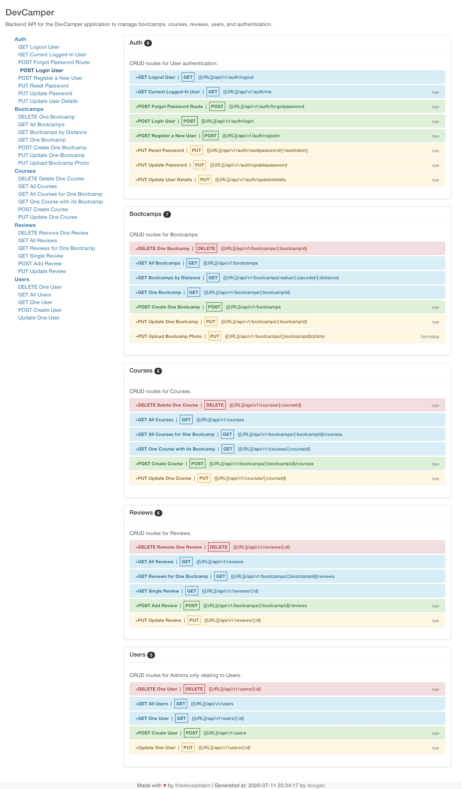

# _{DevCamper_Backend_API}_

#### _{An API for serving data about Bootcamps, their courses, and reviews}, {07/21/2020}_

#### By _**{Chris Underwood}**_

## Description

_{ Create the backend for a bootcamp directory website. The database is MongoDB and is hosted in Atlas not withing the application. The specs for the application are below: }_

### Bootcamps

- List all bootcamps in the database
  - Pagination
  - Select specific fields in result
  - Limit number of results
  - Filter by fields
- Search bootcamps by radius from zipcode
  - Use a geocoder to get exact location and coords from a single address field
- Get single bootcamp
- Create new bootcamp
  - Authenticated users only
  - Must have the role "publisher" or "admin"
  - Only one bootcamp per publisher (admins can create more)
  - Field validation via Mongoose
- Upload a photo for bootcamp
  - Owner only
  - Photo will be uploaded to local filesystem
- Update bootcamps
  - Owner only
  - Validation on update
- Delete Bootcamp
  - Owner only
- Calculate the average cost of all courses for a bootcamp
- Calculate the average rating from the reviews for a bootcamp

### Courses

- List all courses for bootcamp
- List all courses in general
  - Pagination, filtering, etc
- Get single course
- Create new course
  - Authenticated users only
  - Must have the role "publisher" or "admin"
  - Only the owner or an admin can create a course for a bootcamp
  - Publishers can create multiple courses
- Update course
  - Owner only
- Delete course
  - Owner only

### Reviews

- List all reviews for a bootcamp
- List all reviews in general
  - Pagination, filtering, etc
- Get a single review
- Create a review
  - Authenticated users only
  - Must have the role "user" or "admin" (no publishers)
- Update review
  - Owner only
- Delete review
  - Owner only

### Users & Authentication

- Authentication will be ton using JWT/cookies
  - JWT and cookie should expire in 30 days
- User registration
  - Register as a "user" or "publisher"
  - Once registered, a token will be sent along with a cookie (token = xxx)
  - Passwords must be hashed
- User login
  - User can login with email and password
  - Plain text password will compare with stored hashed password
  - Once logged in, a token will be sent along with a cookie (token = xxx)
- User logout
  - Cookie will be sent to set token = none
- Get user
  - Route to get the currently logged in user (via token)
- Password reset (lost password)
  - User can request to reset password
  - A hashed token will be emailed to the users registered email address
  - A put request can be made to the generated url to reset password
  - The token will expire after 10 minutes
- Update user info
  - Authenticated user only
  - Separate route to update password
- User CRUD
  - Admin only
- Users can only be made admin by updating the database field manually

## Security

- Encrypt passwords and reset tokens
- Prevent cross site scripting - XSS
- Prevent NoSQL injections
- Add a rate limit for requests of 100 requests per 10 minutes
- Protect against http param polution
- Add headers for security (helmet)
- Use cors to make API public (for now)

## Documentation

- Use Postman to create documentation
- Use docgen to create HTML files from Postman
- Add html files as the / route for the api

## Deployment (Digital Ocean)

- Push to Github
- Create a droplet - https://m.do.co/c/5424d440c63a
- Clone repo on to server
- Use PM2 process manager
- Enable firewall (ufw) and open needed ports
- Create an NGINX reverse proxy for port 80
- Connect a domain name
- Install an SSL using Let's Encrypt

## Code Related Suggestions

- NPM scripts for dev and production env
- Config file for important constants
- Use controller methods with documented descriptions/routes
- Error handling middleware
- Authentication middleware for protecting routes and setting user roles
- Validation using Mongoose and no external libraries
- Use async/await (create middleware to clean up controller methods)
- Create a database seeder to import and destroy data

## Setup/Installation Requirements

\_Make sure you have Node.js installed globally
\_Clone or fork the files to a file location of your choice
\_Go to the folder/location of the download or where you have moved the files
\_At the root of the folder run npm i
\_In the confing folder, rename config.env2 to config.env and give it the values to the variables included.
\_Seed the database. See below for details.
\_At the terminal type npm run dev to start the backend server.
\_In your web browser, navigate to localhost:5000 to see if the server is running.

##### Destroy all data

node seeder -d

##### Import all data

node seeder -i

## Known Bugs

_{None that I am aware of. This is only a backend api. There currently is no associated frontend. }_

## Support and contact details

_{cunderwoodmn [at] gmail {dot} com}_

## Technologies Used

_{MongoDB, Mongoose, Atlas, bcryptjs, colors, cookie-parser, cors, dotenv, express, express-fileupload, express-mongo-sanitize, express-rate-limit, helmet, hpp, jsonwebtoken, morgan, node-geocoder, nodemailer, slugify, xss-clean, nodemon Node.js, npm}_

### License

\_{ MIT License

Copyright (c) [2020][chris underwood]

Permission is hereby granted, free of charge, to any person obtaining a copy of this software and associated documentation files (the "Software"), to deal in the Software without restriction, including without limitation the rights to use, copy, modify, merge, publish, distribute, sublicense, and/or sell copies of the Software, and to permit persons to whom the Software is furnished to do so, subject to the following conditions:

The above copyright notice and this permission notice shall be included in all copies or substantial portions of the Software.

THE SOFTWARE IS PROVIDED "AS IS", WITHOUT WARRANTY OF ANY KIND, EXPRESS OR IMPLIED, INCLUDING BUT NOT LIMITED TO THE WARRANTIES OF MERCHANTABILITY, FITNESS FOR A PARTICULAR PURPOSE AND NONINFRINGEMENT. IN NO EVENT SHALL THE AUTHORS OR COPYRIGHT HOLDERS BE LIABLE FOR ANY CLAIM, DAMAGES OR OTHER LIABILITY, WHETHER IN AN ACTION OF CONTRACT, TORT OR OTHERWISE, ARISING FROM, OUT OF OR IN CONNECTION WITH THE SOFTWARE OR THE USE OR OTHER DEALINGS IN THE SOFTWARE.}\_

Copyright (c) 2020 **_{Chris Underwood}_**

